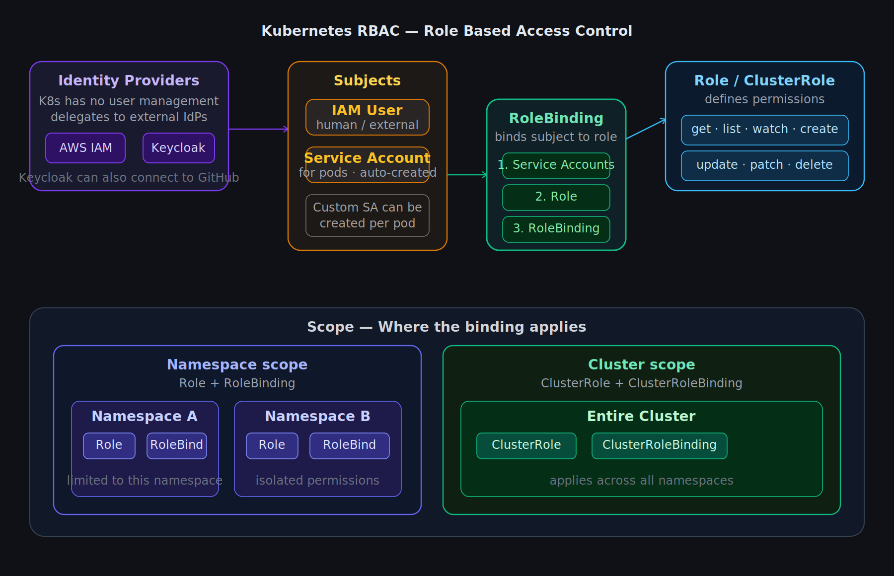

# Kubernetes RBAC

RBAC stands for **Role Based Access Control**. It plays a major role in security — each user has a role defined, and their actions are limited based on that role.

---

## Types

1. Service Account
2. Role / ClusterRole
3. RoleBinding / ClusterRoleBinding

---

## K8s scenario

Kubernetes does not have its own user management or role management. It delegates this responsibility to **identity providers**.

For example, on AWS EKS the identity provider can be an IAM user.

---

## Keycloak

Keycloak is a common tool used for RBAC. It can also be connected to GitHub for better feature usage.

---

## Service Account

- One can create a service account for their pods.
- However, a **default service account is always created** for every pod automatically.

---

## How RoleBinding works

RoleBinding has 3 components:

| Component | Purpose |
|---|---|
| Service Account | The subject (the user or pod) |
| Role | Specifies the permissions |
| RoleBinding | Binds the permissions to the subject based on the role |

---

## Scope

| Scope | Resources used |
|---|---|
| Namespace level | Role + RoleBinding |
| Cluster level | ClusterRole + ClusterRoleBinding |