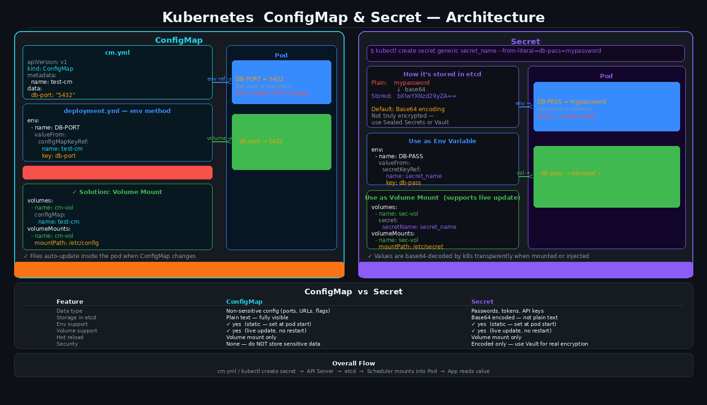

# Kubernetes ConfigMap & Secret

ConfigMap is used to store **normal, non-sensitive** configuration data that pods need — like port numbers, URLs, or feature flags.  
Never store passwords or keys in a ConfigMap — etcd stores it as a plain object, so it can be compromised.

---

## ConfigMap

### Steps

**1. Create `cm.yml`**

```yaml
apiVersion: v1
kind: ConfigMap
metadata:
  name: test-cm
data:
  db-port: "5432"
```

**2. Reference it in `deployment.yml`**

```yaml
env:
  - name: DB-PORT
    valueFrom:
      configMapKeyRef:
        name: test-cm
        key: db-port
```

### Problem

Containers don't allow env vars to change while running. If you update the ConfigMap, the pod won't see the new value until it restarts.

### Solution — Volume Mount

Define a volume that points to the ConfigMap, then mount it inside the container. The file updates automatically when the ConfigMap changes — no pod restart needed.

```yaml
volumes:
  - name: cm-vol
    configMap:
      name: test-cm

volumeMounts:
  - name: cm-vol
    mountPath: /etc/config
```

---

## Secret

Used for sensitive data — passwords, tokens, API keys.

### Create a secret

```bash
kubectl create secret generic secret_name --from-literal=db-pass=mypassword
```

The value is stored as **Base64 encoded** in etcd. It doesn't reveal plain text, but Base64 is not true encryption — anyone with etcd access can decode it.

### Use as Env Variable (static)

```yaml
env:
  - name: DB-PASS
    valueFrom:
      secretKeyRef:
        name: secret_name
        key: db-pass
```

### Use as Volume Mount (supports live update)

```yaml
volumes:
  - name: sec-vol
    secret:
      secretName: secret_name

volumeMounts:
  - name: sec-vol
    mountPath: /etc/secret
```

Kubernetes decodes the value transparently — your app reads plain text from the file.

---

## Architecture Diagram



---

## ConfigMap vs Secret

| Feature | ConfigMap | Secret |
|---|---|---|
| Data type | Non-sensitive config | Passwords, tokens, keys |
| Storage in etcd | Plain text | Base64 encoded |
| Env support | ✓ yes (static) | ✓ yes (static) |
| Volume support | ✓ yes (live update) | ✓ yes (live update) |
| Hot reload | Volume mount only | Volume mount only |
| Security | None | Encoded, not encrypted |

---

## Overall Flow

```
cm.yml / kubectl create secret
        ↓
   API Server
        ↓
      etcd
        ↓
  Scheduler mounts into Pod
        ↓
   App reads the value
```