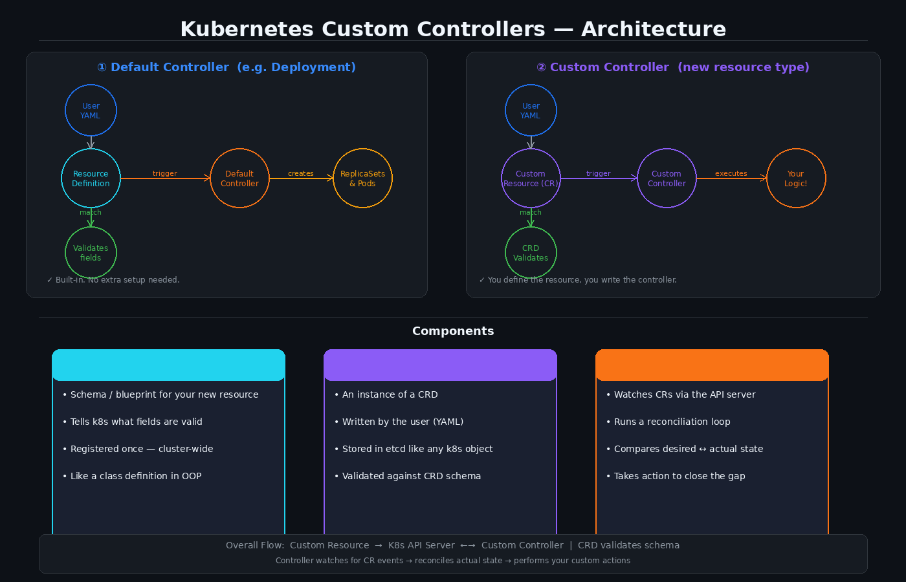

# Kubernetes Custom Controllers

Kubernetes ships with built-in resources — `Deployment`, `Service`, `ConfigMap`, `Secret`, and so on. Custom controllers let you **add your own resource types** to the cluster when the built-ins are not enough.

---

## Components

### CRD — Custom Resource Definition
The **blueprint**. It tells Kubernetes what your new resource looks like — which fields are allowed, their types, and which are required. You register a CRD once and it becomes available cluster-wide.  
Think of it as a *class definition* in object-oriented programming.

### CR — Custom Resource
An **instance** of a CRD. The user writes a YAML file for it, just like they would for a Deployment. Kubernetes stores it in `etcd` and validates it against the CRD schema before accepting it.

### Custom Controller
The **brain**. It watches for CR events via the API server and runs a **reconciliation loop**:

```
observe actual state  →  compare with desired state  →  take action to close the gap
```

---

## Workflow

### 1. How a default controller works (Deployment example)

```
User YAML  →  Resource Definition (template)
                      │
               validates fields
                      │  match
                      ↓
             Default Controller  →  creates ReplicaSets & Pods
```

1. User writes a Deployment YAML.
2. Kubernetes checks it against the built-in resource definition (the template).
3. If a field is invalid or missing — error is thrown.
4. If valid — the Deployment controller kicks in and creates ReplicaSets and Pods.

### 2. How a custom controller works

```
User YAML  →  Custom Resource (CR)
                      │
               CRD validates
                      │  match
                      ↓
             Custom Controller  →  executes your logic
```

1. You first deploy a **CRD** — the schema for your new resource.
2. User writes a CR YAML (an instance of that CRD).
3. Kubernetes validates the CR against the CRD schema.
4. Your **Custom Controller** detects the new CR and performs whatever action you programmed.

---

## Architecture

```
Custom Resource  →  K8s API Server  ←→  Custom Controller
                           ↑
                    CRD (validates schema)
```



---

## Key Idea

> The CRD defines **what** the resource looks like.  
> The CR is **one instance** of that resource.  
> The Custom Controller decides **what to do** when that resource appears.