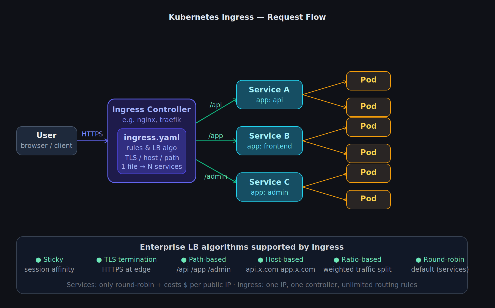

# Kubernetes Ingress

Ingress is a feature provided by Kubernetes that allows you to implement different load balancing algorithms and acts as an API gateway.



---

## Problems before Ingress

1. **Limited load balancing** — Services only support round-robin. It lacks the security and flexibility demanded at enterprise level.
2. **Cost of public IPs** — To expose an app to the real world, Services use a LoadBalancer type which gets a static public IP. Cloud providers charge for each IP address, which becomes expensive as services scale.

---

## Enterprise-level load balancer demands

| Algorithm | Description |
|---|---|
| Sticky | Routes a user to the same pod every time (session affinity) |
| TLS | Terminates HTTPS at the edge — handles certificates centrally |
| Path-based | Routes `/api`, `/app`, `/admin` to different services |
| Host-based | Routes `api.example.com` and `app.example.com` separately |
| Ratio-based | Splits traffic by weight — useful for canary deployments |

---

## How Ingress works

1. You deploy an **Ingress Controller** (e.g. nginx, Traefik) into your cluster — this is the actual component doing the routing.
2. You write an **`ingress.yaml`** file that defines the routing rules — which path or host goes to which Service.
3. Through **one Ingress**, you can manage 100s of Services — all behind a single public IP.

```
User → Ingress Controller (ingress.yaml rules) → Service A / B / C → Pods
```

This solves both problems: you get advanced routing algorithms, and you only pay for one IP address.