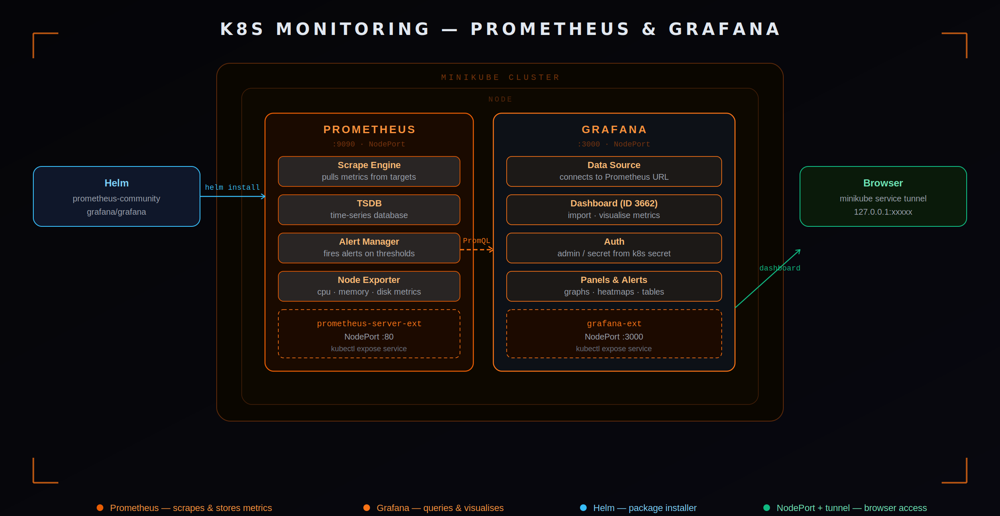
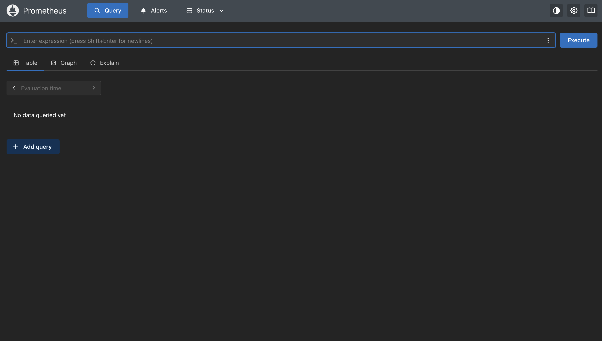
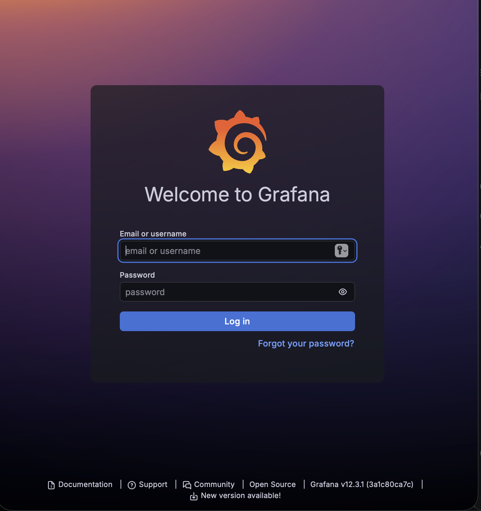
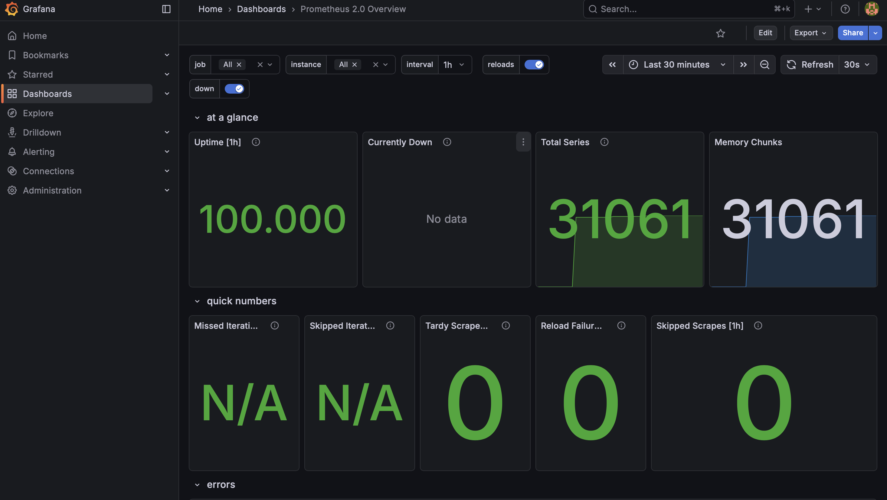
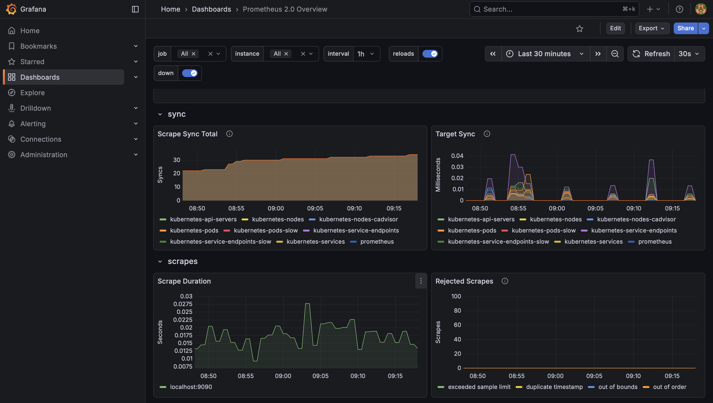
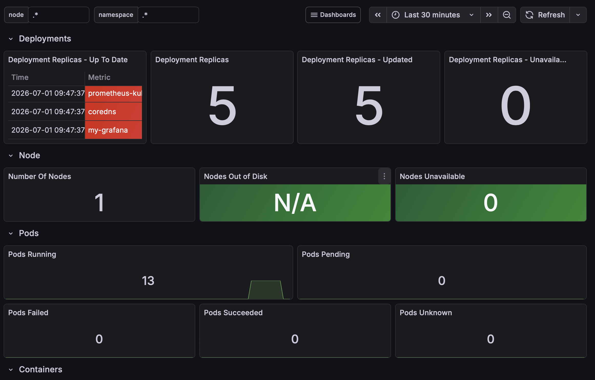

# K8s Monitoring — Prometheus & Grafana




---
[!Prometheus_Architecture](prometheus-architecture.gif)
 
---

## Install Prometheus

```bash
# 1. Install Helm
brew install helm

# 2. Add Prometheus repo
helm repo add prometheus-community https://prometheus-community.github.io/helm-charts

# 3. Update the repo
helm repo update

# 4. Install Prometheus
helm install my-prometheus prometheus-community/prometheus
```

### Expose Prometheus (NodePort)

```bash
kubectl expose service prometheus-server \
  --type=NodePort \
  --target-port=9090 \
  --name=prometheus-server-ext
```

```bash
# Docker driver only
minikube service prometheus-server-ext
```

This launches the Prometheus dashboard.



---

## Install Grafana

```bash
# 1. Add Grafana repo
helm repo add grafana https://grafana.github.io/helm-charts

# 2. Update the repo
helm repo update

# 3. Install Grafana
helm install my-grafana grafana/grafana
```

### Expose Grafana (NodePort)

```bash
kubectl expose service my-grafana \
  --type=NodePort \
  --target-port=3000 \
  --name=grafana-ext
```

```bash
# Docker driver only
minikube service grafana-ext
```

This launches the Grafana dashboard.



### Grafana credentials

```
username: admin
```

```bash
# Fetch password
kubectl get secret --namespace default my-grafana \
  -o jsonpath="{.data.admin-password}" | base64 --decode ; echo
```

---

## Grafana dashboard setup

1. Create a data source
2. Select **Prometheus**
3. Add the Prometheus URL: `http://prometheus-server-ext:80`
4. Go to **Dashboards → Import**
5. Use dashboard ID **3662**
6. Select source as **Prometheus**

---

## Mac + Docker driver — how browser access works

```
Mac Browser ──(blocked natively)──────────────────────┐
    │                                                   │
    │ minikube service tunnel                           ▼
    ▼                              ┌─── Minikube (Docker Container) ───┐
http://127.0.0.1:xxxxx ──────────►│  NodePort                         │
                                   │      │                            │
                                   │      ▼                            │
                                   │  Grafana Pod                      │
                                   │  URL: http://prometheus-server:80 │
                                   └───────────────────────────────────┘
```

---

## Dashboard visuals



