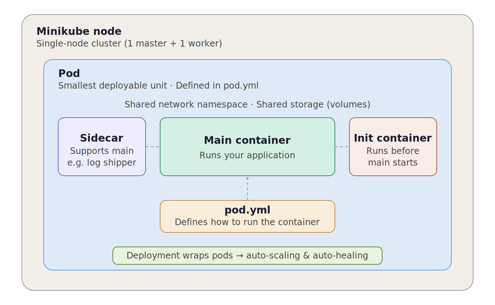

# Kubernetes Pods

## What is a Pod?

A **Pod** is the smallest deployable unit in Kubernetes. It is defined in a `pod.yml` file, which describes how to run one or more containers.



### Key concepts

- A pod can run a **single container** or **multiple containers**.
- When multiple containers run in a pod, they share:
  - **Network** — same IP address and port space
  - **Storage** — shared volumes mounted across containers
- **Sidecar containers** run alongside the main container to support it (e.g. log shippers, proxies).
- **Init containers** run and complete *before* the main container starts (e.g. for setup tasks).

> To get auto-scaling and auto-healing, pods are managed by a **Deployment** (a wrapper around pods).

---

## Setup

1. Install `kubectl` — the CLI tool for Kubernetes.
2. Install `minikube` — runs a local single-node cluster (1 master + 1 worker) for learning.

---

## Commands

### Start the cluster

```bash
minikube start
```
Creates a VM with a single-node Kubernetes cluster. Uses the Docker driver by default.

```bash
kubectl get nodes
```
Shows info about the nodes in the cluster.

---

### Create a Pod

```bash
kubectl create -f pod.yml
```
Creates a pod from your `pod.yml` definition file.

---

### Get Pod info

```bash
kubectl get pods
kubectl get pods -o wide    # more detailed output
```

---

### Debug a Pod

```bash
kubectl describe pod <pod-name>
```
Shows the full status of everything inside the pod. Useful for debugging.

```bash
kubectl logs <pod-name>
```
Prints the application logs from the pod.

---

### Delete a Pod

```bash
kubectl delete pod <pod-name>
```