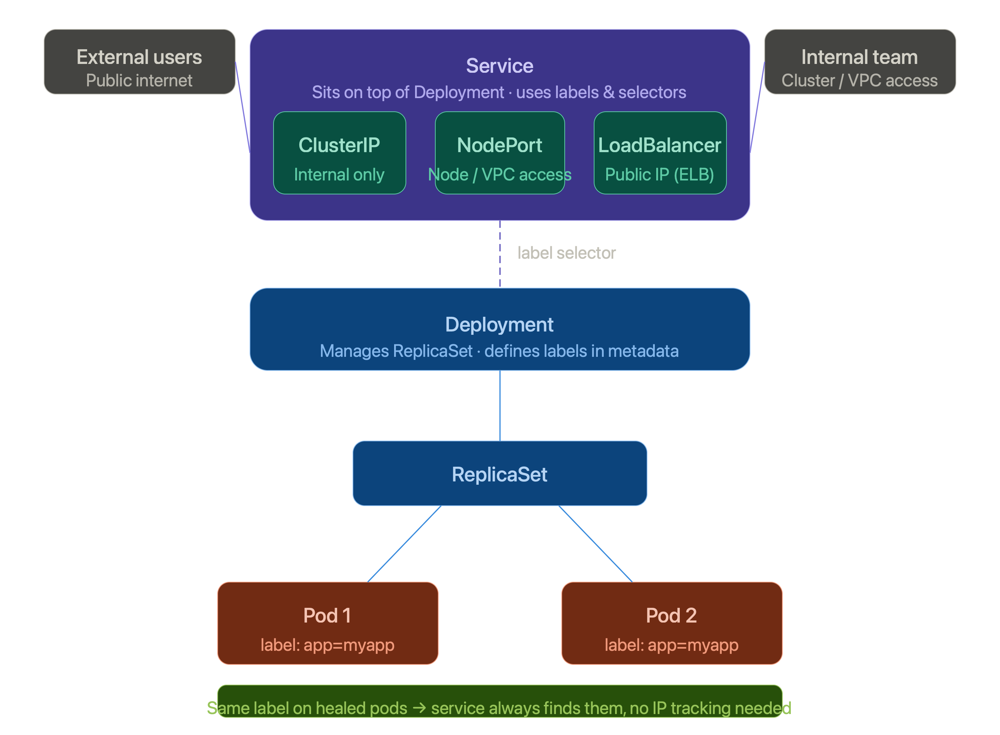

# K8s Services

> Services work on top of deployment to solve the gaps that deployment alone cannot handle.

---

## Problems & Solutions

### 🔴 Problem 1 — Pods get new IPs on heal

When auto-healing creates a new pod, it gets a fresh IP address. With hundreds of pods running, teams have no way to know — and keep hitting the old, terminated address. This increases debugging time and is inefficient.

#### ✅ Solution — Load Balancing

Instead of directly accessing pods with an IP address, we implement a load balancer in the service. It distributes traffic automatically — no IP address required. However, this alone is not a complete solution.

---

### 🔴 Problem 2 — Load balancer still knows only old IPs

Even with a load balancer, it learned the old IP. After healing, the new pod has a fresh IP — the balancer can still route to the dead address, causing inconvenience to users and teams.

#### ✅ Solution — Labels & Selectors

Services don't track IPs at all. Pods carry **labels** defined in the deployment metadata. In case any pod is healed, the newly created one inherits the same label automatically.

**Basic structure:**

```
Deployment → ReplicaSet → Pod 1 (app: my-app)
                        → Pod 2 (app: my-app)
                        → Healed Pod (app: my-app)  ← same label, no config change
```

Load balancing uses the label for traffic distribution — not the IP address.

---

### 🔴 Problem 3 — App is unreachable outside the cluster

The app works inside K8s, but you can't share cluster credentials with end users or other teams just to let them access it. This is a major issue in production.

#### ✅ Solution — Service Discovery (3 modes)

Services provide a **service discovery** feature with 3 access modes:

| Mode | Access Level | Use Case |
|---|---|---|
| **Cluster IP** | Internal only | DevOps & internal teams with cluster access |
| **Node Port** | VPC / node level | Teams working on nodes or with VPC access |
| **Load Balancer** | Public internet | External world access |

**How Load Balancer works on AWS:**

On AWS, the Load Balancer mode instructs EKS to provision an Elastic Load Balancer with a public IP address. That public IP becomes the entry point for the external world.

---

## Diagram



